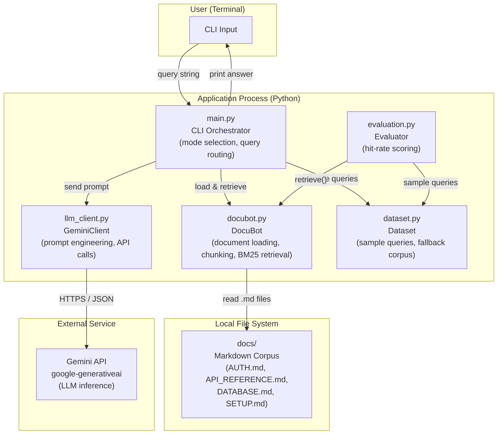

# DocuBot System Architecture Overview

## 1. System Overview Diagram

**Three operating modes wired through `main.py`:**

| Mode | Path |
|------|------|
| 1 – Naive LLM | `DocuBot.full_corpus_text()` → `GeminiClient.naive_answer_over_full_docs()` |
| 2 – Retrieval Only | `DocuBot.retrieve()` → print raw snippets |
| 3 – RAG | `DocuBot.retrieve()` → `GeminiClient.answer_from_snippets()` |

---

## 2. Component Catalog

| Component | Technology | Primary Responsibility | Key Files | Heavy Logic |
|-----------|-----------|----------------------|-----------|-------------|
| **DocuBot** | Python, rank-bm25 | Load docs from disk, chunk by section, build BM25 index, retrieve top-k snippets | [docubot.py](../../docubot.py) | `_chunk_by_section()` splits on `## ` headings; `build_index()` tokenizes corpus into BM25Okapi; `retrieve()` scores all chunks and filters score > 0 |
| **GeminiClient** | google-generativeai, Python | Wrap Gemini API with two prompt strategies (naive vs RAG), enforce refusal on low-confidence answers | [llm_client.py](../../llm_client.py) | Prompt construction with citation instructions; refusal guard ("I do not know based on the docs I have."); full-corpus vs snippet prompt branching |
| **CLI Orchestrator** | Python stdlib | Parse mode selection, route queries through the three operating modes, gracefully degrade when API key missing | [main.py](../../main.py) | Mode branching logic; `try_create_llm_client()` graceful degradation; `get_query_or_use_samples()` interactive vs batch flow |
| **Evaluator** | Python stdlib | Measure retrieval hit-rate against keyword-to-file ground truth; produce per-query breakdown | [evaluation.py](../../evaluation.py) | Keyword-based expected-source mapping; hit-rate calculation over sample query set |
| **Dataset** | Python (static data) | Supply 8 canonical test queries and in-memory fallback corpus when `docs/` folder is absent | [dataset.py](../../dataset.py) | Fallback document text (used when `docs/` is missing); ground-truth query list shared by main and evaluator |

---

## 3. Technology Stack

| Layer | Technology |
|-------|-----------|
| **UI Layer** | Terminal / Python `input()` + `print()` |
| **State / Logic Layer** | Pure Python classes (`DocuBot`, `GeminiClient`); no framework |
| **Retrieval Layer** | `rank-bm25` — BM25Okapi algorithm |
| **Service / API Layer** | `google-generativeai` SDK → Gemini REST API |
| **Data Layer** | Local Markdown files in `docs/`; in-memory fallback in `dataset.py` |
| **Configuration** | `python-dotenv` reading `.env` for `GEMINI_API_KEY` |
| **External Dependencies** | Google Gemini API (cloud LLM inference) |

---

## 4. Integration Points

| From | To | Protocol | Format | Sync/Async |
|------|----|----------|--------|------------|
| `main.py` | `DocuBot` | In-process Python call | Python objects (`list[tuple[str,str]]`) | Sync |
| `main.py` | `GeminiClient` | In-process Python call | Python strings | Sync |
| `GeminiClient` | Gemini API | HTTPS REST | JSON request/response | Sync (blocking) |
| `DocuBot` | `docs/` filesystem | File I/O (`open()`) | Plain text / Markdown | Sync |
| `evaluation.py` | `DocuBot` | In-process Python call | Python objects | Sync |
| `evaluation.py` | `dataset.py` | In-process Python import | Python list | Sync |

---

## 5. Where to Start

- **To understand user interactions**, read: [main.py](../../main.py) — `choose_mode()` and the three `run_*_mode()` functions show the full interaction flow.
- **To understand retrieval / data flow**, start with: [docubot.py](../../docubot.py) — `load_documents()` → `_chunk_by_section()` → `build_index()` → `retrieve()` is the complete pipeline.
- **To understand LLM / prompt logic**, start with: [llm_client.py](../../llm_client.py) — the two prompt templates (`naive_answer_over_full_docs` vs `answer_from_snippets`) capture the core design tradeoff.
- **To understand evaluation**, start with: [evaluation.py](../../evaluation.py) — the keyword-to-file ground truth map and hit-rate loop are the entire harness.
- **To understand the corpus**, read the files in [docs/](../../docs/) — 4 Markdown files covering AUTH, API, DATABASE, and SETUP.
